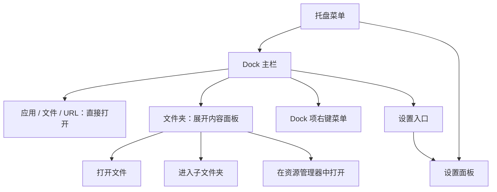

# TidyDock 设计文档

版本：v1.0  
日期：2026-06-27  
适用平台：Windows 10 / Windows 11

## 1. 设计目标

TidyDock 是一款轻量 Windows 桌面 Dock 工具，用来美化桌面并收纳用户手动添加的常用入口。它参考 macOS Dock 的视觉和文件夹 Stack 体验，但不替代 Windows 任务栏，也不承担桌面文件整理、任务切换、应用监控等系统能力。

第一版的核心目标是：

- 低内存、低 CPU、低打扰。
- 用户完全手动添加、删除、排序 Dock 项目。
- Dock 默认为一个连续容器，不做默认分区。
- 支持应用、快捷方式、文件夹、文件、URL。
- 文件夹只在用户点击时按需读取，并弹出可滚动内容面板。
- 空闲状态不扫描、不索引、不监控、不联网。

一句话设计原则：

> 少做功能，把 Dock 本身做轻、做顺、做稳。

## 2. 产品边界

### 2.1 第一版要做什么

- 显示一个悬浮 Dock 栏。
- 支持用户手动添加应用、快捷方式、文件夹、文件和 URL。
- 支持拖入文件、文件夹、`.exe`、`.lnk` 添加到 Dock。
- 支持拖拽调整 Dock 项目顺序。
- 支持图标 hover 放大效果。
- 支持 Dock 背景透明度设置为 0，完全隐藏 Dock 背景。
- 支持编辑模式，只有编辑模式下允许修改 Dock 项目。
- 支持点击应用、文件、URL 后打开目标。
- 支持点击文件夹后弹出类似 macOS Dock Stack 的滚动内容面板。
- 支持进入文件夹面板中的子文件夹并返回上一级。
- 支持右键编辑 Dock 项目名称、路径、图标和移除项目。
- 支持基础外观设置、托盘入口和开机启动。
- 支持本地配置保存和图标缓存。

### 2.2 第一版明确不做什么

- 不扫描桌面。
- 不自动分类整理文件。
- 不显示最近文件。
- 不显示运行状态小圆点。
- 不提供窗口列表。
- 不做任务切换。
- 不监控应用状态。
- 不做后台索引。
- 不做复杂规则引擎。
- 不替代 Windows 任务栏。
- 不做文件删除、复制、剪切、粘贴。
- 不做文件搜索。
- 不生成图片或视频缩略图。
- 不上传数据，不联网同步。

这些能力全部从第一版中砍掉，避免产品变重，也避免用户误解为文件管理器或任务栏替代品。

## 3. 信息架构

第一版由三个主要界面组成：

1. Dock 主栏
2. 文件夹内容面板
3. 设置面板

辅助入口包括：

- 托盘菜单
- Dock 项右键菜单

整体关系如下：



## 4. Dock 主栏设计

### 4.1 默认布局

- 默认位于屏幕底部居中。
- Dock 是一个连续容器，不默认区分应用区、文件夹区、文件区或最近项目区。
- 应用、文件夹、文件、URL 在视觉上平等，都是用户手动放进去的入口。
- 分隔符不是默认结构，只是用户可选添加的视觉分组工具。
- 原型中展示的文件夹项目，例如 Projects、Downloads，只代表用户手动添加到 Dock 的文件夹入口，不代表软件自动生成的“独立文件夹区域”。

### 4.2 支持位置

Dock 支持四个屏幕位置：

- 底部
- 顶部
- 左侧
- 右侧

第一版优先把底部体验打磨完整。顶部、左侧、右侧需要基础可用，但不追求复杂动画适配。

### 4.3 Dock 项目类型

支持的项目类型：

- 应用：`.exe`
- 快捷方式：`.lnk`
- 文件夹
- 普通文件
- URL
- 分隔符

Dock 项目基础字段：

```json
{
  "id": "item-001",
  "type": "app",
  "name": "Chrome",
  "target": "C:\\Program Files\\Google\\Chrome\\Application\\chrome.exe",
  "icon": "icons\\chrome.png",
  "sortOrder": 1
}
```

字段说明：

- `id`：项目唯一标识。
- `type`：项目类型，可取 `app`、`shortcut`、`folder`、`file`、`url`、`separator`。
- `name`：显示名称。
- `target`：目标路径或 URL。
- `icon`：缓存图标或自定义图标路径。
- `sortOrder`：Dock 内排序位置。

### 4.4 点击行为

- 应用：启动应用。
- `.lnk`：按 Windows 快捷方式原有逻辑打开。
- 文件：使用系统默认程序打开。
- URL：使用默认浏览器打开。
- 文件夹：展开文件夹内容面板。
- 分隔符：无打开行为。

点击行为必须由用户主动触发。软件不主动打开、预读或分析用户文件。

### 4.5 拖拽行为

- 只有编辑模式开启时，拖入文件、文件夹、`.exe`、`.lnk` 可添加 Dock 项目。
- 只有编辑模式开启时，拖拽 Dock 图标可调整顺序。
- 编辑模式下，拖拽过程中显示插入位置反馈。
- 编辑模式下，拖拽完成后立即保存配置。
- 文件夹面板打开时，应避免误触发 Dock 项目排序。

### 4.6 右键菜单

Dock 项右键菜单包含：

- 打开
- 在资源管理器中显示

编辑模式开启时，右键菜单额外包含：

- 编辑名称
- 编辑目标路径或 URL
- 更换图标
- 从 Dock 移除

文件夹项目额外支持：

- 在资源管理器中打开

删除规则：

- “从 Dock 移除”只删除 Dock 配置项。
- 不删除原始应用、文件或文件夹。
- 不移动用户文件。

### 4.7 Hover 放大

hover 放大是 Dock 的核心视觉反馈。

设计要求：

- 鼠标悬停图标时，当前图标放大。
- 邻近图标可轻微联动放大。
- 鼠标离开后恢复原始大小。
- 动画短促、顺滑、克制。
- 动画结束后停止重绘。

性能要求：

- 只计算鼠标附近的图标。
- 不在空闲状态持续动画。
- 不因单个 hover 触发全窗口重排。
- 不使用高频定时器驱动 UI。

### 4.8 自动隐藏

第一版自动隐藏做简单规则：

- 默认关闭。
- 开启后，鼠标离开 Dock 一段时间后隐藏。
- 鼠标移动到对应屏幕边缘后显示。
- 文件夹面板打开时不自动隐藏。

第一版不做：

- 全屏游戏检测。
- 视频播放检测。
- 智能避让任务栏。
- 复杂窗口层级判断。

## 5. 文件夹内容面板设计

### 5.1 设计定位

文件夹内容面板不是文件管理器，只是一个快速访问入口。

它解决的问题是：用户把一个常用文件夹手动放进 Dock 后，可以像 macOS Dock Stack 一样快速展开、滚动浏览并打开其中内容。

### 5.2 展开方式

第一版采用弹出式滚动网格。

展开方向：

- Dock 在底部：向上弹出。
- Dock 在顶部：向下弹出。
- Dock 在左侧：向右弹出。
- Dock 在右侧：向左弹出。

### 5.3 面板结构

文件夹面板包含：

- 顶部工具栏
- 返回按钮
- 当前文件夹名称
- 在资源管理器中打开按钮
- 关闭按钮
- 可滚动内容网格

内容网格展示：

- 文件夹
- 文件
- 文件类型图标
- 文件名

### 5.4 面板交互

- 点击文件：用默认程序打开。
- 点击文件夹：进入该子文件夹。
- 点击返回：回到上一级。
- 点击资源管理器按钮：在资源管理器中打开当前文件夹。
- 点击面板外部：关闭面板。
- 按 `Esc`：关闭面板。
- 鼠标滚轮：上下滚动。

### 5.5 读取规则

为了保持轻量和隐私安全，文件夹读取必须遵守：

- 只在用户点击 Dock 文件夹时读取。
- 只读取当前文件夹的直接子项目。
- 不递归读取子目录。
- 不读取文件内容。
- 不生成缩略图。
- 默认不显示隐藏文件。
- 面板关闭后释放临时列表数据。
- 不缓存文件夹列表，只缓存必要图标。

### 5.6 排序规则

第一版默认排序：

1. 文件夹在前
2. 文件在后
3. 同类型按名称排序

### 5.7 数量限制

为避免大目录导致卡顿：

- 默认最多显示 300 个项目。
- 超过限制时，只显示前 300 个。
- 面板底部提示项目过多。
- 始终提供“在资源管理器中打开”入口。

### 5.8 明确不支持的文件管理操作

- 多选
- 删除
- 重命名
- 复制
- 剪切
- 粘贴
- 搜索
- 预览
- 拖拽移动文件

这些操作交给 Windows 资源管理器处理。

## 6. 设置面板设计

### 6.1 常规设置

- 开机启动
- 启动时显示 Dock
- 显示托盘图标
- 始终置顶
- 语言
- 打开配置目录
- 打开日志目录
- 清理图标缓存
- 重置配置
- 退出程序
- 关于

托盘图标设置需要有安全保护：如果用户关闭托盘图标，应确保仍有其他可见入口可以重新打开设置或退出程序。

### 6.2 外观设置

- Dock 位置
- 显示器选择
- 编辑模式
- 图标基础大小
- 图标间距
- hover 放大倍数
- 背景透明度
- 背景透明度可设置为 0，完全隐藏 Dock 背景和阴影
- 圆角大小
- 屏幕边距
- 主题：跟随系统、浅色、深色

### 6.3 行为设置

- 自动隐藏
- 文件夹面板最大高度
- 文件夹面板最大展示数量
- 是否显示隐藏文件

### 6.4 项目管理

设置面板中提供 Dock 项目管理能力：

- 查看所有 Dock 项目。
- 添加应用、文件、文件夹、URL、分隔符。
- 调整项目顺序。
- 编辑名称。
- 编辑目标路径。
- 更换图标。
- 移除项目。

## 7. 托盘设计

托盘菜单包含：

- 显示 / 隐藏 Dock
- 设置
- 关于
- 退出

行为规则：

- 关闭设置窗口不退出程序。
- 关闭 Dock 只是隐藏 Dock，不退出程序。
- 退出程序需要从托盘菜单或设置面板中触发。
- 如果托盘图标被关闭，Dock 本体仍应提供进入设置的方式。

## 8. 视觉风格

### 8.1 整体气质

关键词：

- 轻
- 透明
- 安静
- 顺滑
- 克制
- Windows 友好

### 8.2 Dock 视觉

- 半透明背景。
- 背景透明度为 0 时，Dock 背景和阴影完全隐藏，只保留用户放置的项目。
- 适度毛玻璃效果。
- 轻阴影。
- 圆角矩形。
- 图标尺寸稳定。
- 不默认分区。
- 不放大面积说明文字。
- 不使用营销式大卡片布局。

### 8.3 图标策略

图标是视觉质量的关键。

策略：

- Dock 主图标在添加项目时提取并缓存。
- 用户可以手动更换图标。
- 文件夹内容面板使用系统文件类型图标。
- 不生成图片、视频缩略图。
- 不缓存文件夹列表。

### 8.4 动画策略

需要的动画：

- Dock hover 放大。
- 文件夹面板展开 / 收起。
- 拖拽排序反馈。
- 设置窗口出现 / 关闭。

不需要的动画：

- 持续浮动。
- 背景动态效果。
- 粒子效果。
- 高消耗模糊动画。

## 9. 数据设计

配置保存为本地 JSON。

示例：

```json
{
  "dock": {
    "position": "bottom",
    "display": "primary",
    "iconSize": 48,
    "iconGap": 10,
    "magnification": 1.5,
    "opacity": 0.78,
    "cornerRadius": 18,
    "autoHide": false,
    "alwaysOnTop": false
  },
  "folderPanel": {
    "maxItems": 300,
    "showHiddenFiles": false,
    "maxHeight": 420
  },
  "items": [
    {
      "id": "item-001",
      "type": "app",
      "name": "Chrome",
      "target": "C:\\Program Files\\Google\\Chrome\\Application\\chrome.exe",
      "icon": "icons\\chrome.png",
      "sortOrder": 1
    },
    {
      "id": "item-002",
      "type": "folder",
      "name": "Projects",
      "target": "D:\\Projects",
      "icon": "icons\\folder.png",
      "sortOrder": 2
    }
  ]
}
```

## 10. 本地文件结构

建议数据目录：

```text
%APPDATA%/TidyDock/
  config/
    settings.json
  cache/
    icons/
  logs/
    error.log
```

说明：

- `settings.json` 保存用户配置。
- `cache/icons/` 保存提取后的 Dock 图标。
- `logs/error.log` 只记录必要错误，不记录用户文件列表。
- 不保存文件夹展开历史。
- 不保存最近文件。

## 11. 技术架构

推荐技术栈：

- C#
- WPF
- 少量 Win32 API

选择理由：

- 比 Electron 更适合轻量常驻工具。
- Windows 托盘、快捷方式、开机启动、系统图标支持成熟。
- 透明窗口和无边框窗口实现方便。
- 可控内存占用和启动速度。

### 11.1 模块划分

- `DockShell`：Dock 主窗口。
- `DockItemService`：Dock 项管理。
- `IconCacheService`：图标提取和缓存。
- `LaunchService`：启动应用、打开文件、打开 URL。
- `FolderPanelService`：按需读取文件夹内容。
- `SettingsService`：配置读写。
- `TrayService`：托盘菜单。
- `StartupService`：开机启动。
- `ThemeService`：主题和颜色。
- `ErrorLogService`：错误日志。

### 11.2 DockShell

职责：

- 创建无边框透明窗口。
- 控制 Dock 位置。
- 渲染 Dock 项目。
- 处理 hover 放大。
- 处理拖拽排序。
- 调用对应服务打开目标。
- 管理文件夹面板的显示位置。

### 11.3 DockItemService

职责：

- 管理 Dock 项增删改查。
- 判断拖入项目类型。
- 保存排序。
- 处理分隔符。
- 保证移除 Dock 项不会影响源文件。

### 11.4 IconCacheService

职责：

- 提取 `.exe`、`.lnk`、文件类型图标。
- 缓存 Dock 主图标。
- 支持用户自定义图标。
- 提供清理缓存能力。

图标策略：

- Dock 项图标可缓存。
- 文件夹面板里的文件类型图标按需加载。
- 不生成缩略图。
- 不缓存目录列表。

### 11.5 FolderPanelService

职责：

- 用户点击文件夹时读取目录。
- 限制最大项目数。
- 排序文件夹和文件。
- 异步返回结果，避免 UI 卡顿。
- 面板关闭后释放列表数据。

禁止行为：

- 不递归扫描。
- 不读取文件内容。
- 不监控目录变化。
- 不后台预加载。

### 11.6 SettingsService

职责：

- 读取配置。
- 写入配置。
- 配置损坏时备份并恢复默认值。
- 写入时使用临时文件替换，降低损坏风险。
- 确保配置、缓存、日志目录存在。

## 12. 性能设计

### 12.1 空闲状态

空闲状态只保留：

- Dock 窗口。
- 托盘图标。
- 当前配置。
- 已缓存 Dock 图标。

空闲状态不做：

- 文件扫描。
- 目录监听。
- 进程监控。
- 网络请求。
- 定时索引。
- 持续动画。

### 12.2 文件夹展开

文件夹展开时：

- 异步读取目录。
- 只读取直接子项。
- 限制项目数量。
- 使用轻量列表或网格渲染。
- 图标懒加载。
- 面板关闭后释放数据。

### 12.3 动画

- hover 动画只作用于附近图标。
- 动画结束后停止渲染。
- 不做持续背景动画。
- 不用高频定时器驱动 UI。

### 12.4 性能目标

- 空闲 CPU 接近 0%。
- 启动时间目标小于 1 秒。
- 常驻内存控制在轻量桌面工具合理范围内。
- 大文件夹打开时 UI 不明显卡死。
- 关闭文件夹面板后临时内存可释放。

## 13. 异常状态设计

### 13.1 目标不存在

- Dock 项保留。
- 图标显示异常状态或默认图标。
- 点击时提示目标不存在。
- 右键允许编辑路径或移除。

### 13.2 文件夹无权限

- 面板显示无权限提示。
- 提供资源管理器打开入口。
- 不反复重试。
- 不记录文件列表。

### 13.3 文件夹项目过多

- 只显示限制数量内的项目。
- 显示数量提示。
- 提供资源管理器打开入口。

### 13.4 配置损坏

- 备份损坏配置。
- 创建默认配置。
- 提示用户配置已重置。

## 14. 多屏设计

第一版做轻量多屏支持：

- 默认显示在主显示器。
- 设置中可选择显示器。
- 显示器配置变化时，如果原显示器不可用，则回到主显示器。
- 不跨屏显示。
- 不跟随当前活动窗口。

## 15. 原型说明

当前 HTML 原型用于验证：

- Dock 连续容器视觉。
- hover 放大效果。
- 用户手动添加的文件夹项目。
- 文件夹点击展开。
- 文件夹内容滚动网格。
- 子文件夹进入和返回。
- 设置面板基础控制。
- 拖拽排序反馈。

原型不表达：

- 桌面扫描。
- 桌面文件自动管理。
- 应用运行状态。
- 任务栏替代。
- Dock 默认分区。
- 自动生成的独立文件夹区域。

## 16. MVP 验收标准

### 16.1 功能验收

- 可以添加 `.exe`。
- 可以添加 `.lnk`。
- 可以添加文件夹。
- 可以添加普通文件。
- 可以添加 URL。
- 可以添加分隔符。
- 关闭编辑模式时，不允许添加、删除、排序、改名、修改路径或更换图标。
- 开启编辑模式时，可以添加、删除、排序、改名、修改路径和更换图标。
- 可以在编辑模式下拖拽调整 Dock 项顺序。
- 点击应用、文件、URL 可以打开。
- 点击文件夹可以展开内容面板。
- 文件夹面板可以进入子文件夹并返回。
- 文件夹面板可以在资源管理器中打开当前目录。
- 可以在编辑模式下右键编辑、移除、更换图标。
- 可以调整 Dock 图标大小、间距、透明度、圆角和位置。
- 可以通过托盘或设置退出程序。

### 16.2 性能验收

- 空闲 CPU 接近 0%。
- 启动时间小于 1 秒。
- 常驻内存在目标范围内。
- 不扫描桌面。
- 不监控应用。
- 不产生网络请求。
- 大文件夹打开时 UI 不明显卡死。
- 文件夹面板关闭后释放列表数据。

### 16.3 安全和隐私验收

- 移除 Dock 项不会删除原文件。
- 软件不会自动移动用户文件。
- 软件不会读取未添加的文件夹内容。
- 文件夹内容只在点击时读取。
- 配置保存在本地。
- 图标缓存保存在本地。
- 错误日志不记录用户文件列表。
- 无后台上传行为。

## 17. 后续版本边界

可以谨慎考虑：

- 文件夹面板列表模式。
- 更多主题细节。
- 图标尺寸预设。
- 配置导入导出。
- 显示 / 隐藏 Dock 快捷键。
- 多套 Dock 配置。
- 不同显示器不同 Dock。

不建议轻易加入：

- 自动整理文件。
- 进程监控。
- 任务切换。
- 最近文件。
- 后台索引。
- 复杂规则引擎。

## 18. 最终设计结论

TidyDock 第一版的价值不在于功能数量，而在于边界清晰、体验稳定和资源占用低。

它不是任务栏替代品，不是文件整理器，不是窗口管理器，也不是自动化工具。它只做一件事：给 Windows 用户一个低占用、可手动布局、视觉舒服的桌面快捷入口。

第一版最重要的体验是：

- Dock 默认连续，不人为分区。
- 文件夹展开清晰顺滑。
- 常驻后台没有存在感。
- 用户文件绝对安全。
- 所有行为都由用户主动触发。
